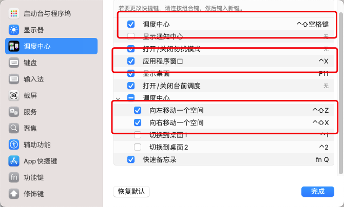
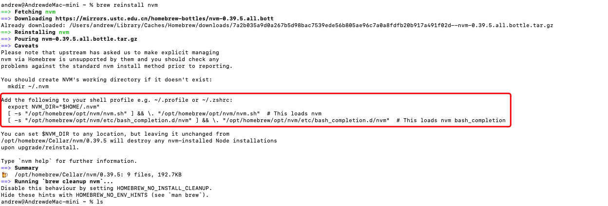
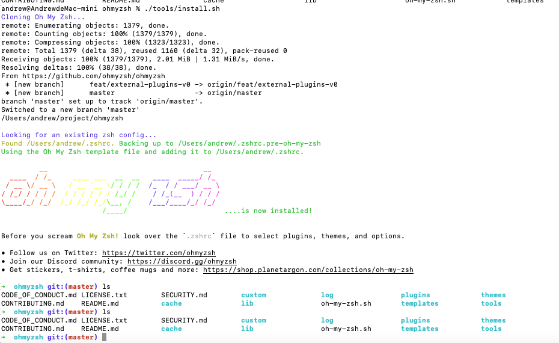
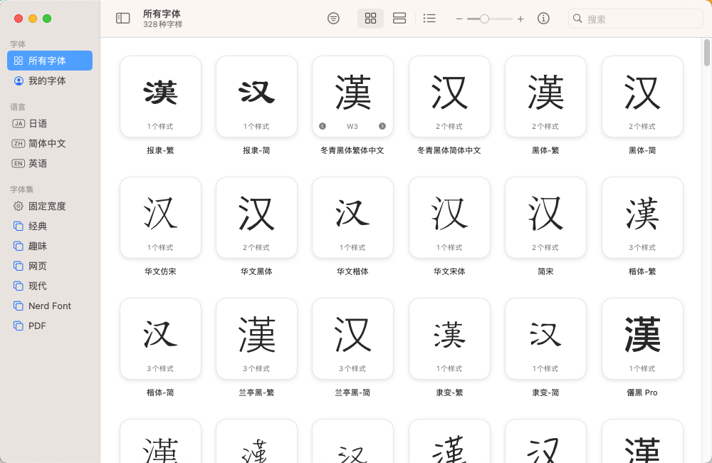
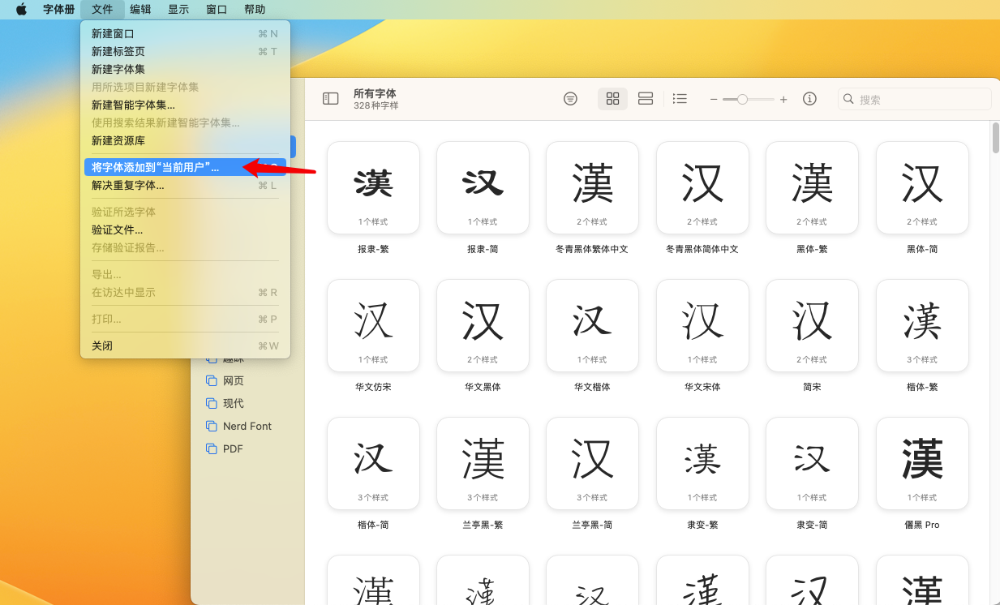
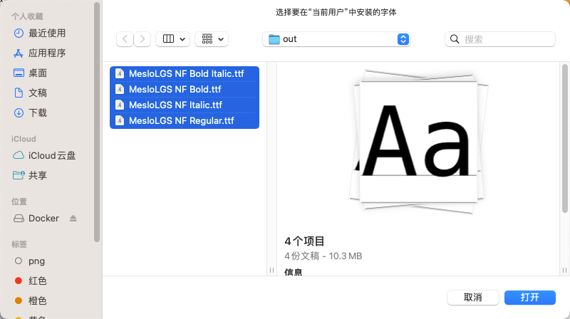
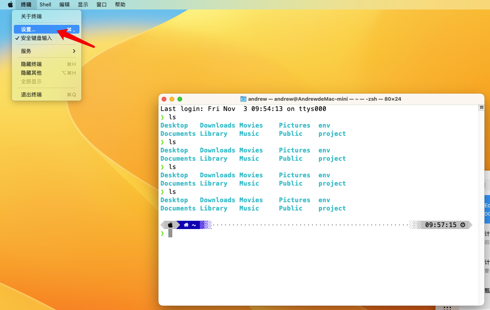
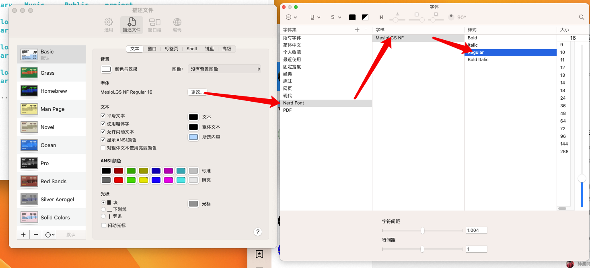
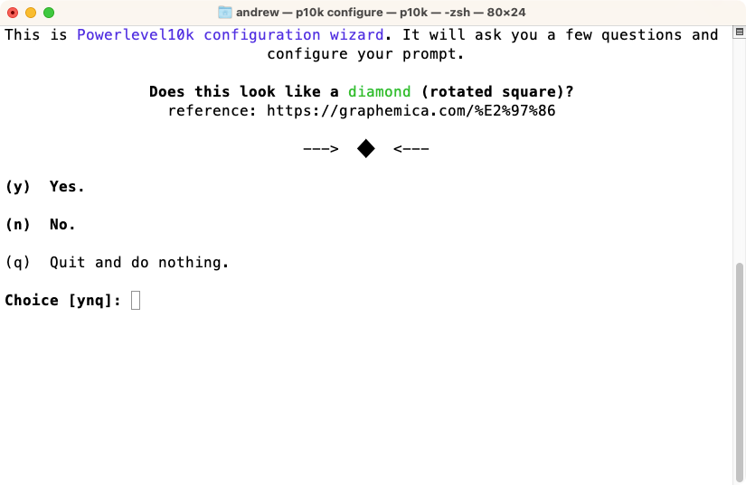
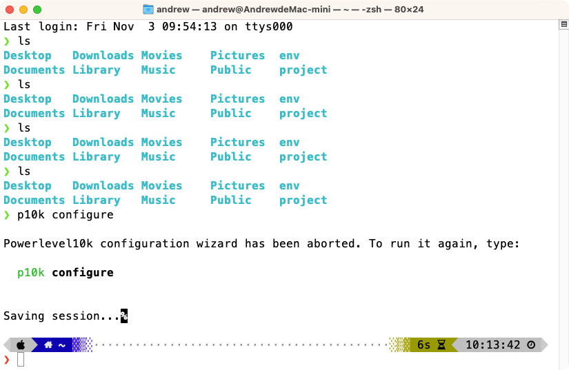

# 【持续更新】初见 Mac(Apple Silicon)

## 背景

实习发工资了，来一次报复性消费，买了个丐中丐的 mac mini 8G 256G M2。之前使用过的 Mac 都是公司发的，自己还是不算真正意义上的会配置，
这一次终于算是有机会了，因此现在在这里记录一下，增加一下经验。

## 行动

### 组合键替换

mac mini 没有触控板，而且触控板也很贵，最好用键盘来切屏，原来的是`ctrl + 上下左右`，现在想改成**可以左手单手操作**的组合键。

方式：依次打开「设置」->「键盘」->「键盘快捷键」->「调度中心」（嗯，原来这玩意搁苹果里叫「调度中心」）

### Homebrew

大陆内比较坑，没有办法直接在 `Homebrew` 官网上面复制那条命令下载，因此需要特殊的方法。

好在知乎上面有人已经帮忙实现了，是个好人，记得给他点赞，[看看这里](https://zhuanlan.zhihu.com/p/111014448)。

我们可以通过 `Homebrew` 安装一些我们需要的东西。
- `nvm` node.js 版本管理器，请务必按照提示走，不要忘了这里

### Docker

直接在官网找客户端下载，很方便。[点击这里](https://www.docker.com/get-started/)

### oh-my-zsh

[Github 地址](https://github.com/ohmyzsh/ohmyzsh)

由于我们还是简中特供的环境，还是无法直接使用官方推荐的方式安装。
其实可以直接将仓库直接 clone 下来，然后运行 `ohmyzsh/tools/install.sh`，就直接安装完了，并且会在`.zshrc`上面写上大量的配置。

不过安装完了之后要`source ~/.profile`，因为在安装过程中会把配置覆盖掉了。

如果要搞各种个性化配置的话可以看[这个油管视频](https://www.youtube.com/watch?v=d4bTkiftBOk&t=324s)

如果要换主题，可以在`.zshrc`中找到`ZSH_THEME`的变量，更改就行，可以参考[这里](https://github.com/ohmyzsh/ohmyzsh#themes)。
但是有更好的办法，就是使用`powerlevel10k`，[这里是Github地址+跳到教程](https://github.com/romkatv/powerlevel10k#oh-my-zsh)。
然后需要`source .zshrc`，这样会跳出提示说你没有`p10k`的配置先进行一个配置，跟着走就行了（忘了截图，但是官方给的教程还是很有引导性的）。

如果遇到了这个配置无法显示一些特殊的图形符号，可以[看这里](https://github.com/romkatv/powerlevel10k/blob/master/README.md#icons-glyphs-or-powerline-symbols-dont-render)（这个过程非常漫长，要耐心等待），安装推荐的`Nerd Font`，
安装完成后会在其目录下的`out`目录，里面就有`Nerd Font`的 ttf，我们打开**字体册(Font Boot) App**，再去找到装有这些字体的目录，将其添加进来即可。

然后需要将其加入到系统字体里面，就需要点击左上角的设置，见此图。

然后重启终端，运行`p10k configure`，后面就可以支持更好康的主题了。

最后的配置如下（费劲吧啦，应该可以提效）
