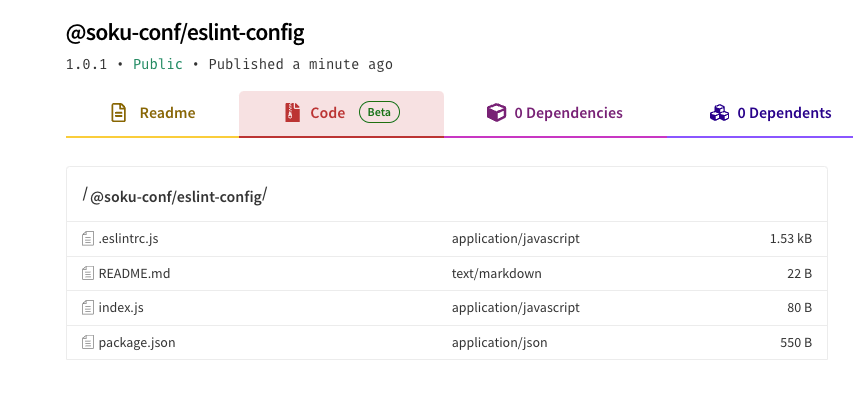

# 我也要有自己的 Eslint

## 背景

不觉得很酷吗？身为一名~~前端工程师~~JS工程师，我觉得**拥有一个自己的 eslint 配置**这件事简直太棒了。（何言何语）

## 目标

我希望我的配置有如下。

- 末尾分号
- 单引号优先
- 缩进 2 spaces
- bracket 带空格（Object 带，Array 不带）
- 换行长文本（Object，Array，Params）后面都带逗号
- import 排序 + 自动合并
- `[] {}` 内没有多余的空格，但是`[]`首尾不能有空格，`{}`首尾必须有空格
- 冒号、逗号后面必须有空格
- 运算符与数字之间必须空格
- `try-catch`以及`if-else`都必须单独一行而不是合并上一个的尾部
- 关掉一些`ts`的规则，太烦人了（比如必须给回调传入类型，类型断言最好不要用 as 等等）

然后可以发布成 npm 包，后续方便直接使用。

## 行动

### 0. 怎么查到这些对应的配置

看官方文档，或者**使用GPT**。

最终配置如下
```js
module.exports = {
  'env': {
    'browser': true,
    'es2021': true,
  },
  'extends': [
    'eslint:recommended',
    'plugin:@typescript-eslint/recommended',
  ],
  'overrides': [
    {
      'env': {
        'node': true,
      },
      'files': [
        '.eslintrc.{js,cjs}',
      ],
      'parserOptions': {
        'sourceType': 'script',
      },
    },
  ],
  'parser': '@typescript-eslint/parser',
  'parserOptions': {
    'ecmaVersion': 'latest',
    'sourceType': 'module',
  },
  'plugins': [
    '@typescript-eslint',
    'import',
  ],
  'rules': {
    'indent': ['error', 2],
    'comma-dangle': ['error', 'always-multiline'],
    'linebreak-style': ['error', 'unix'],
    'quotes': ['error', 'single'],
    'semi': ['error', 'always'],
    'space-infix-ops': 'error',
    'no-extra-parens': 'error',
    'no-multi-spaces': 'error',
    'space-in-parens': ['error', 'never'],
    'object-curly-spacing': ['error', 'always'],
    'array-bracket-spacing': ['error', 'never'],
    'comma-spacing': 'error',
    'key-spacing': 'error',
    'brace-style': ['error', 'stroustrup', {
      'allowSingleLine': true,
    }],

    'import/order': 2,
    'import/no-duplicates': ['error', {
      'prefer-inline': true,
    }],

    '@typescript-eslint/interface-name-prefix': 'off',
    '@typescript-eslint/explicit-function-return-type': 'off',
    '@typescript-eslint/explicit-module-boundary-types': 'off',
    '@typescript-eslint/no-explicit-any': 'off',
    '@typescript-eslint/no-empty-interface': 'off',
  },
};

```

### 1. 如何使其可以作为一个 npm 包，目录结构怎么做

我们先创建一个目录叫`soku-eslint-config`，然后在里面`pnpm init`，`pnpm i -D eslint`，
然后通过命令以及问答的方式生成一个`eslintrc.js`，也就是运行`npx eslint --init`，注意在说是否希望生成预设好的社区流行方案的时候，选择自己通过问答的方式生成，
然后一路配置自己喜欢的配置，**文件格式必须选择js**。

然后可以发现在根目录上生成了一个`.eslintrc.js`，注意，这个时候我们在根目录下创建一个`index.js`，并将`.eslintrc.js`暴露出去，见下图。


在`package.json`中配置一些其他信息吧。


### 2. 如何发布 npm 包

首先需要在命令行中运行`npm login`，跟着指示走，在浏览器上登陆自己的 npm 账号即可。


注意：如果像我这样写的是`@xxx/eslint-config`，就需要先在 npm 网上在自己的账号创建一个 organization，比如`@soku-conf`需要创建 soku-conf organization


这样就成功创建了属于自己的组织。


最后我们可以在根目录下运行`npm publish --access public`来发布了，然后上 npm 官网看一下发布的包里面文件是否符合预期。



### 3. 如何测试

如果你是想直接在包上面测试，可以创建一个`src/test.ts`的文件去测试。

如果希望可以视作外来的依赖，可以先在包的根目录下运行`npm link`，然后再在其他地方创建一个 node.js 项目，同样安装 eslint，
然后运行`npm link <你的这个配置的依赖包名>`，就可以发现`node_modules`中加载到了这个配置（其实是建立了一个链接，更新是同步的），也可以测试。

我们把包发布之后，可以再另开新的 node.js 项目，下载下来，然后同样的方式创建 eslintrc ，然后我们运行`pnpm i -D @soku-conf/eslint-config`，安装我们配置好的规则。

安装完毕后，在`.eslintrc`中的`extends`加上自己的配置，也就是`extends: ["@soku-conf", ...]`，然后就可以测试一下是否生效了。
