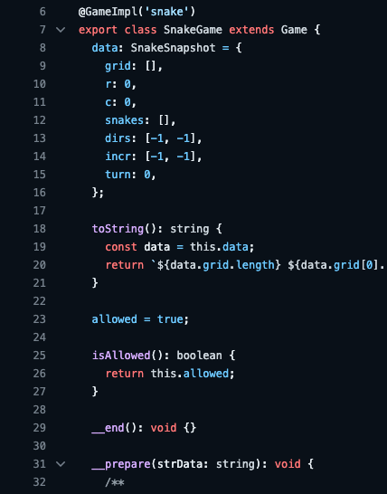
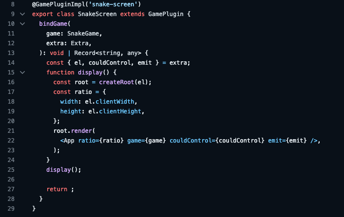
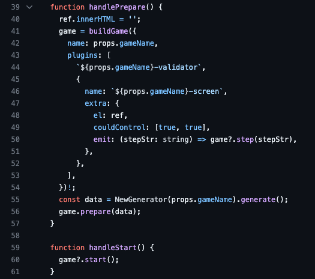
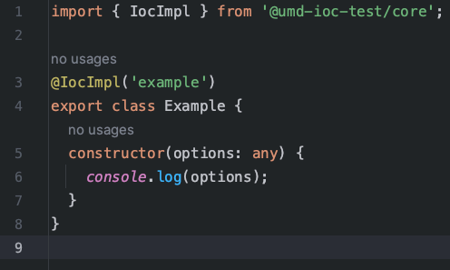
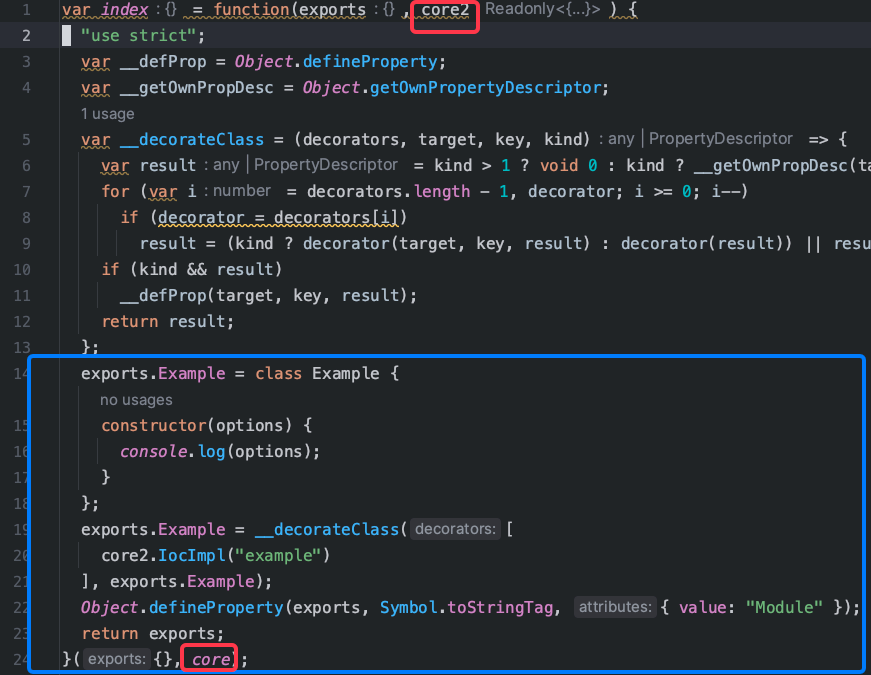
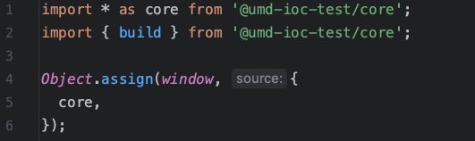
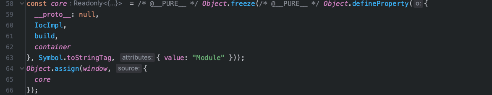
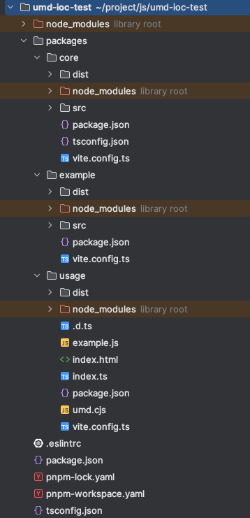
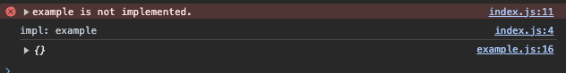

# CDN 与 IoC 的相结合

最近在完成我的[毕设项目](https://github.com/Board-Game-Bot)，有了一些思考，然后想出来的方案也是比较简单但是有效。

然后可能有点标题党，CDN 是一个具体方案，我的本意是**可以通过网络下载文件的方式**。

下列图片中可能有`umd-ioc-test`字样，是错的，理解就好。

## 背景

首先描述一下我的毕设项目：一个棋牌游戏 + 博弈代码平台。

当然，我们这里只关注**棋牌游戏**。在我的想法上，棋牌游戏可以统一归类为**step by step**的游戏，也就是**回合制**游戏。

同时，我也希望在运行时的时候可以灵活创建游戏，加载游戏之上的插件，都可以使用字符串来定位到游戏/插件。

因此我设计了一个[SDK](https://github.com/Board-Game-Bot/soku-games)，使用的是
**IoC** 的思想，使用一个单例容器管理所有游戏的 Class，这样在运行时就能够比较灵活地创建游戏了（比如说，我可能想创建五子棋/黑白棋游戏），建立在此之上的扩展（插件，比如显示器/裁判器/控制器）也是同样的想法。

以下是使用此 SDK 开发案例。

那我要如何去使用？看如下

那么问题来了，这些依赖是什么时候注入进容器的？可以看到开发案例里面，根据装饰器的执行时机，只要加载到文件的时候就注入了。

因此，我假设开发了一个游戏，里面不但有游戏的本体，还有其下的各种插件，并发布到 npm 上面。此时要注意要将 SDK 设为 peerDeps，并且在打包的时候设置为 external，
这样就确保可以使用到业务场景下安装的真正的 SDK ，而注入到正确的容器中。

开发的游戏可以看此[案例](https://github.com/SokuRitszZ/soku-game-backgammon)。

然后在开发自己的项目的时候要想注入，先通过`npm i`来安装，然后可以直接在项目的入口文件中加上`import 'soku-game-backgammon'`，这样就算是加载到文件了，也就真正注入进去了。
当然，也可以在项目中去写新的游戏/插件，使用同样的方式注入。

这里有一个[使用案例](https://github.com/Board-Game-Bot/backend-nest/blob/release/bobdylan/src/soku-games.ts)。

这样做的好处，总的来说有如下几点

- 统一管理游戏的创建，屏蔽创建游戏的细节。
- 灵活拆卸模块，想装/不想装游戏直接增删 import 即可，不再需要写分支逻辑代码 `if...else...`，`switch...case...` 等等。

## 痛点

好了，讲了一大篇幅自己的项目，除了跟 IoC 确实沾上边了，但是 CDN 呢？

这里就是我开发的时候的痛点了：

> - 如果要上架/下架新游戏，那我要在仓库里面拉一个 update 分支，安装/删掉游戏，然后 push 上仓库，作为 release 分支发布，构建新网页。
> 如果要紧急修复游戏中的 bug，也非常不方便，特别是频繁更新的游戏/插件（尽管上线频繁更新的包很显然是一个不合规的行为）。
> - 加大了打包体积，如果后面越来越多游戏，那构建时间可能也要++，对于开发者来说多点摸鱼时间没什么，但是对于用户加载网页就很慢了。

说到这里，相信大部份读者能理解到为什么要上 CDN 了。

## 方案

整体上来看，是一个简单的方案，没有那么高深。

没错，就是**把游戏/插件的包发布到网络上，特别是 CDN 上面，然后在用户浏览网页的时候，下载这个包，下载完成之后自动注入**。

那就要思考：**怎么在下载之后注入到这个正确的容器里**。

我们首先要知道一个前提：**JS 文件加载之后就执行**。

其次：在开发的时候是要使用这个 SDK 的，也会将其打包到生产环境的产物中，**所以要知道如何要让游戏包定位到 SDK**。

先考虑一下，游戏包 JS 文件的模块要用什么形式：首先排除`require`、`umd`，其次，因为引入进来的包会直接打包成一坨代码，esm 模块也没有了，也不可能使用 `esm` 的方式去定位。
因此最后的赢家是 **IIFE**。

然后是定位到 SDK 的问题，我们可以先看一下，将 SDK 作为一个 external 的 IIFE 打包文件是什么形式的。
我们假设要开发一个基于此 SDK 的 example 包，
这里是源文件：（不要纠结为什么命名 umd）

使用 vite 打包，将 SDK 作为 external，为了可读先关闭 minify，产物如下：

可以看出，它会在 `window.core` 中找到这个模块。

所以答案也很简单：**在项目开发的时候，在入口文件将整个模块引入，然后将其挂载到 window.core 上。**

项目打包产物则是如下

## 实践

我们可以通过 `pnpm monorepo` 的方式去验证这个方案的可行性。

文件结构大概是这样，`usage`是一个假想项目，`core`是 SDK，`example`是包。

可以点击[此处](https://github.com/SokuRitszZ/iife-ioc-test)查看并 clone 下来试试。

从上到下依次 `pnpm i` 并且 `pnpm build` 之后，先将 `example` 的打包产物，放到`usage`目录下，并改名为`example.js`。
然后在 `usage` 项目中启动 dev 模式，点击TEST，可以看到的效果：

这里为什么先报错了？因为确实没有注入，在点击事件中会将这个`example.js`文件下载下来，url 写成`./example.js`（当然，这里可以在后面替换成上到 CDN 之后的 url），
在文件下载完成并且加载之后，再去尝试 build ，就能发现成功了。

因此，可以证明此方案是完全可行的。

## 总结

事实上，我在尝试此方案之前没有过使用 IIFE 作为模块方案的经验，纯粹只是初次尝试之后发现方案可行带来的满足感驱使我去总结，
我相信其实很多人在之前也有过这个经验，可能看来只是一则戏言。

在此次实验中还是第一次接触到 `IoC + IIFE` 的使用场景，是个不小的收获。