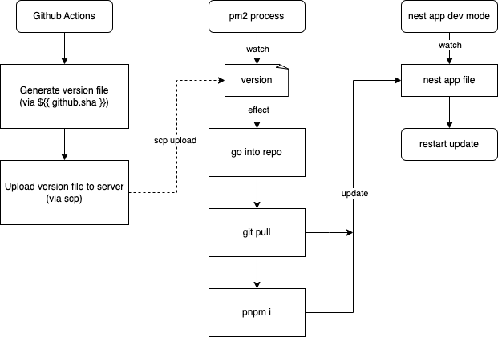

# 极简 Nest.js App 部署流水线

## 背景

在做毕设的时候，我的项目是使用 `Nest.js` 作为后端。

在之前的开发经验中，如果是用`Sprint Boot`的话，可以通过`Github Action`在其中进行`maven`构建，然后将其通过`scp`发送到我的服务器上，
再手动`ctrl + c` + `java -jar ****.jar`的组合技来部署上线。

然而`Nest.js`不一样，构建之后不是完完全全的`js`产物，它仍然带有`require()`，
也就是不像前端打包那样打包完全的，而是还是需要在有这些依赖的环境中进行的！因此需要想其他办法来解决。

## 方案

相信看到这篇文章的标题已经能猜出来了，简单粗暴但有效。

以下是一张简单的 UML 图。



## 行动

### Github Actions workflow 文件配置

因为涉及到使用`scp`，敏感操作需要权限，因此会需要一些`secret variable`的配置，请记得。如果使用了`ssh private key`，记得把生成的公钥加入进`authorized_keys`。

```yaml
name: Deploy 
run-name: "${{ github.actor }} started deploying 🏗"

on:
  push:
    branches:
      - main

jobs:
  deploy:
    runs-on: ubuntu-latest

    steps:
      - name: Checkout code
        uses: actions/checkout@v2

      - name: Configure SSH
        uses: webfactory/ssh-agent@v0.5.0
        with:
          ssh-private-key: ${{ secrets.SSH_PRIVATE_KEY }}
          
      - name: Make version file
        run: |
          echo "${{ github.sha }}" > version
      
      - name: Upload files via SCP
        run: |
          scp -o StrictHostKeyChecking=no -P ${{ secrets.SERVER_PORT }} \
          version ${{ secrets.REMOTE_USER }}@${{ secrets.REMOTE_HOST }}:/path/to/your/project
```

### 服务器上的预备工作

首先，创建一个完成所有这些工作的一个目录，我们假设这个目录的完全路径是`project-path`。

然后我们在此目录下，将`nest.js app` clone 下来，假设项目名就是`backend`，那么整个项目会 clone 到`project-path/backend`。

```shell
git clone git@github.com/backend.git
ls # result: backend/
```
进入此目录中，进行`pnpm i && pnpm start:dev`，先启动项目，再回到`project-path`。

然后仍然在此目录下，创建`update.js`，里面的内容如下。

```js
const cp = require('child_process');

cp.execSync('git pull', { cwd: './backend' });
cp.execSync('pnpm i', { cwd: './backend' });
```
这代表有两行命令将会在`project-path/backend`中执行。

最后，使用 `pm2` 监听文件变化，我们首先在此目录下创建 `version` 文件。
然后运行如下指令，就是大功告成了。

```shell
pm2 start update.js --watch version
```

## 总结

这样的方法有好有坏，好处是**简单粗暴**，坏处则是**无法观察部署是否会出错**，因为流水线只做了**将`github.sha`上传到服务器，后续流程就不关心了。